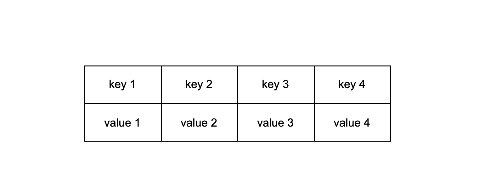
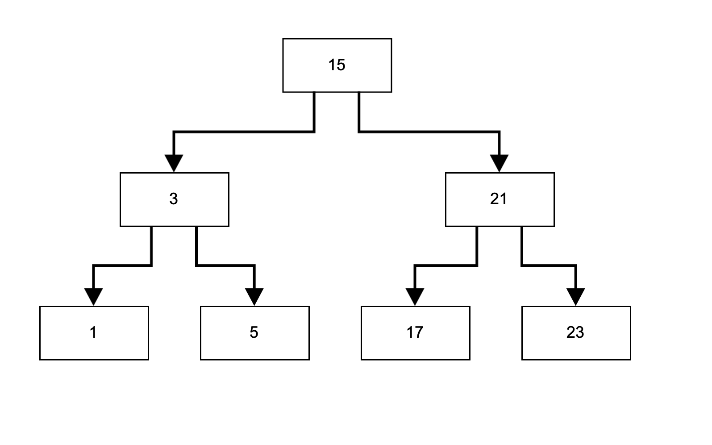
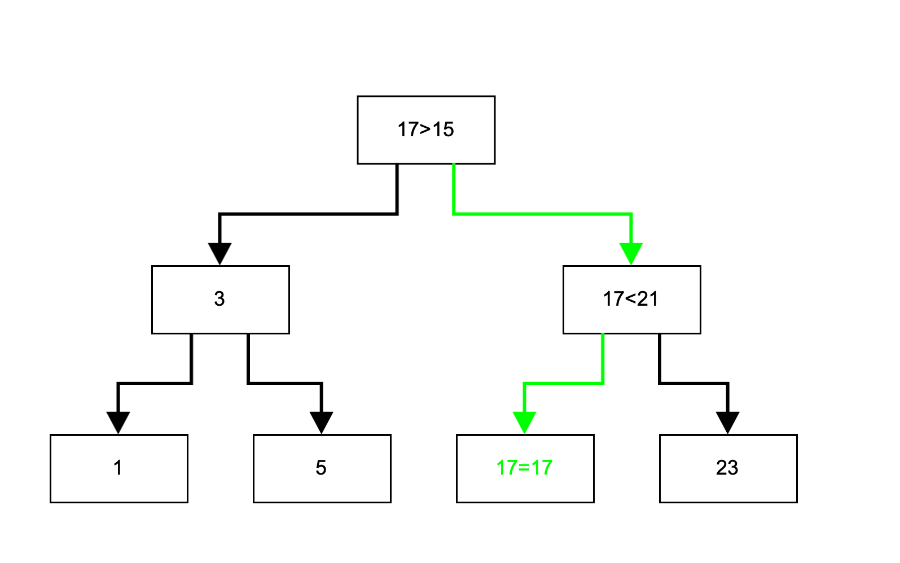

### Map

  
Общая информация

 

Map (словарь) - это ассоциативный контейнер, содержащий отсортированные по возрастанию ключа пары ключ-значение. То есть каждый элемент ассоциирован с некоторым уникальным ключом, и его положение в словаре определяется его ключом. Словари удобно применять, когда необходимо ассоциировать элементы с некоторым другим значением (не индексом). Например, предприятие осуществляет закупку оборудования, причем каждую позицию приходится закупать неоднократно. В таком случае удобно использовать словарь с парой идентификатор позиции - объем закупки. Здесь идентификатором может выступать не только число, но и строка. Таким образом, поиск в словаре осуществляется не по индексу, как в массиве, а по идентификатору - слову. 

Но каким образом словарь позволяет обращаться к парам по ключу и при этом оказывается всегда отсортированным? На самом деле, словарь имеет структуру бинарного дерева поиска (в реализации C++ это дерево - красно-черное), что позволяет сразу добавлять элементы в словарь согласно прямому порядку и находить элементы более эффективно, чем прямой просмотр всех элементов словаря. 

Бинарное дерево поиска - это структура состоящая также и узлов, но каждый узел обладает двумя указателями на двух других узлов - "потомков". В этом случае, текущей узел называется "родительским". В общем виде, бинарное дерево поиска гарантирует, что если у текущего узла есть потомки, то левый "потомок" содержит в себе элемент с меньшим значением, а правый - с большим. Таким образом, для поиска в дереве некоторого элемента, достаточно сравнивать специальной функцией компоратором (в случае со словарем, эта функция зависит от типа ключа) искомое значение со значением текущего узла. Если оно оказалось больше - следует переходить к "правому" потомку, меньше - к левому, а если значение оказалось равным, тогда искомый элемент найден.

  
Спецификация

 

*Map Member type*

В этой таблице перечислены внутриклассовые переопределения типов (типичные для стандартной библиотеки STL), принятые для удобства восприятия кода класса:

| Member type            | Definition                                                                             |
|------------------------|----------------------------------------------------------------------------------------|
| `key_type`               | `Key` the first template parameter (Key)                                                     |
| `mapped_type`           | `T` the second template parameter (T)                                                      |
| `value_type`             | `std::pair<const key_type,mapped_type>` Key-value pair                                                      |
| `reference`              | `value_type &` defines the type of the reference to an element                                                             |
| `const_reference`        | `const value_type &` defines the type of the constant reference                                         |
| `iterator`               | internal class `MapIterator<K, T>` or `BinaryTree::iterator` as internal iterator of tree subclass; defines the type for iterating through the container                                                 |
| `const_iterator`         | internal class `MapConstIterator<K, T>` or `BinaryTree::const_iterator` as internal const iterator of tree subclass; defines the constant type for iterating through the container                                           |
| `size_type`              | `size_t` defines the type of the container size (standard type is size_t) |

*Map Member functions*

В этой таблице перечислены основные публичные методы для взаимодействия с классом:

| Member functions      | Definition                                      |
|----------------|-------------------------------------------------|
| `map()`  | default constructor, creates empty map                                 |
| `map(std::initializer_list<value_type> const &items)`  | initializer list constructor, creates the map initizialized using std::initializer_list<T>    |
| `map(const map &m)`  | copy constructor  |
| `map(map &&m)`  | move constructor  |
| `~map()`  | destructor  |
| `operator=(map &&m)`      | assignment operator overload for moving object                                |

*Map Element access*

В этой таблице перечислены публичные методы для доступа к элементам класса:

| Element access         | Definition                                                                             |
|------------------------|----------------------------------------------------------------------------------------|
| `T& at(const Key& key)`                     | access specified element with bounds checking                                          |
| `T& operator`             | access or insert specified element                                                     |

*Map Iterators*

В этой таблице перечислены публичные методы для итерирования по элементам класса (доступ к итераторам):

| Iterators              | Definition                                                                             |
|------------------------|----------------------------------------------------------------------------------------|
| `iterator begin()`            | returns an iterator to the beginning                                                   |
| `iterator end()`                | returns an iterator to the end                                                         |

*Map Capacity*

В этой таблице перечислены публичные методы для доступа к информации о наполнении контейнера:

| Capacity               | Definition                                                                             |
|------------------------|----------------------------------------------------------------------------------------|
| `bool empty()`                  | checks whether the container is empty                                                  |
| `size_type size()`                   | returns the number of elements                                                         |
| `size_type max_size()`               | returns the maximum possible number of elements                                        |

*Map Modifiers*

В этой таблице перечислены публичные методы для изменения контейнера:

| Modifiers              | Definition                                                                             |
|------------------------|----------------------------------------------------------------------------------------|
| `void clear()`                  | clears the contents                                                                    |
| `std::pair<iterator, bool> insert(const value_type& value)`                 | inserts node and returns iterator to where the element is in the container and bool denoting whether the insertion took place                                        |
| `std::pair<iterator, bool> insert(const Key& key, const T& obj)`                 | inserts value by key and returns iterator to where the element is in the container and bool denoting whether the insertion took place    |
| `std::pair<iterator, bool> insert_or_assign(const Key& key, const T& obj);`       | inserts an element or assigns to the current element if the key already exists         |
| `void erase(iterator pos)`                  | erases element at pos                                                                        |
| `void swap(map& other)`                   | swaps the contents                                                                     |
| `void merge(map& other);`                  | splices nodes from another container                                                   |

*Map Lookup*

В этой таблице перечислены публичные методы, осуществляющие просмотр контейнера:

| Lookup                 | Definition                                                                             |
|------------------------|----------------------------------------------------------------------------------------|
| `bool contains(const Key& key)`                  | checks if there is an element with key equivalent to key in the container                                   |

  
Для тестирования

 
  Зайти в репозиторий

  Ввести в командную строку ''make''  
  Чтобы посмотреть покрытие через браузер, надо открыть файл map_coverage_report.html после использования ''make''

  
Для использования

 
  Достаточно добавить #include "s21_map.h" в заголовок проекта, в котором собираетесь его использовать

